# Scene Understanding & Navigation using LLMs and Behavior Trees for Indoor Mobile Robots

**Master's Thesis** — RWTH Aachen University, Institute of Mechanism Theory, Machine Dynamics and Robotics (IGMR)

**Author:** Ganesh Gopi Thimmankatti  
**Supervisors:** Dr.-Ing. Markus Schmitz (RWTH Aachen) · Dr.-Ing. Navid Nourani-Vatani (FleetSpark UG)  
**Industry Partner:** Sphaira Medical GmbH  
**Date:** August 2025

---

## Abstract

Traditional navigation systems rely on fixed rule-based algorithms that struggle with dynamic, unstructured settings such as hospitals, airports, or shopping malls. This thesis proposes a modular architecture that integrates classical ROS 2 navigation with the high-level reasoning capabilities of a Large Language Model (LLM). The system enables a mobile robot to perceive, reason about, and interact with pedestrians it encounters along its route — yielding, communicating verbally, and replanning — without aborting its navigation goal.

The work was deployed and tested on **MOBY**, a compact indoor mobile robot prototype developed by Sphaira Medical GmbH for human-robot interaction in healthcare and service-oriented environments.

---

## The MOBY Robot Platform

<table>
<tr>
<td>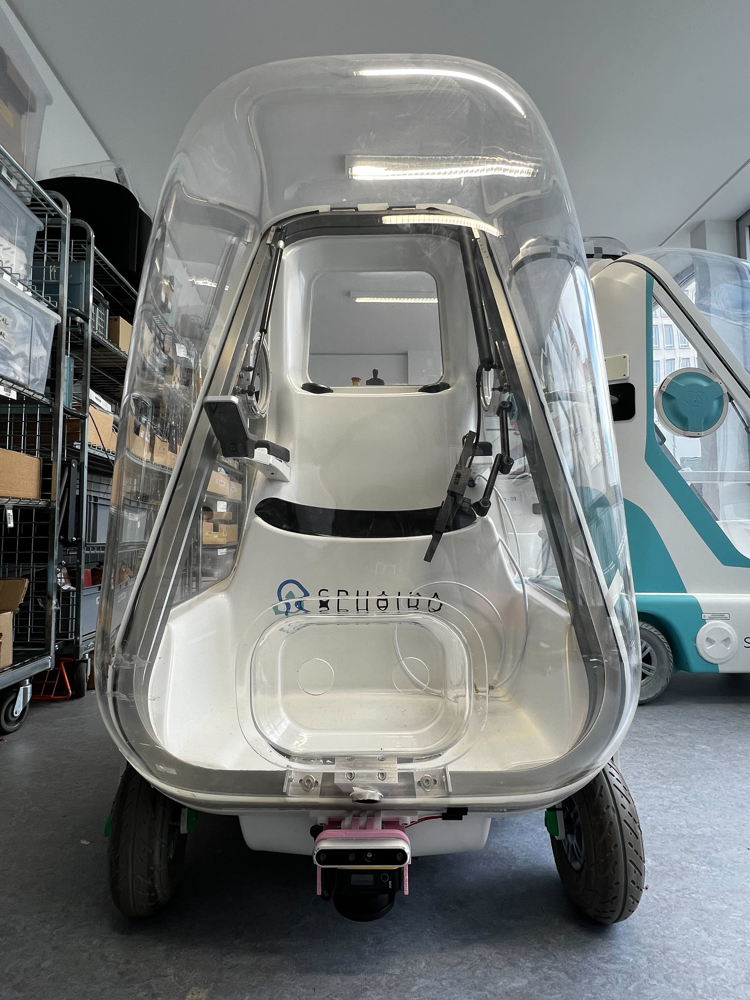</td>
<td>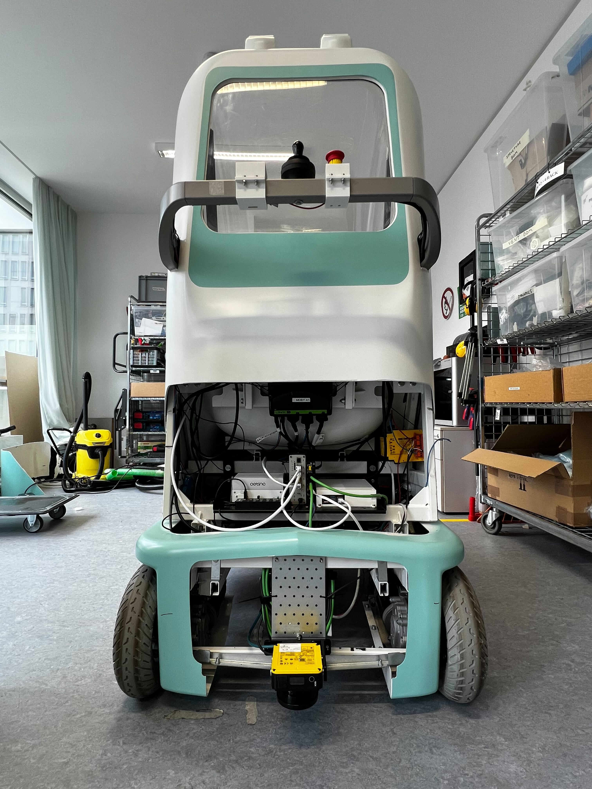</td>
<td>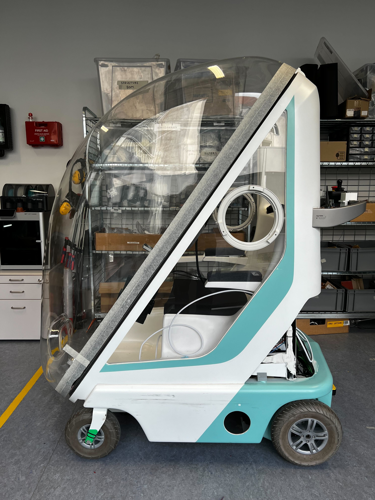</td>
</tr>
<tr><td align="center">Front</td><td align="center">Back</td><td align="center">Side</td></tr>
</table>

| Property | Value |
|---|---|
| Drive | Differential drive |
| Footprint | 1452 mm × 820 mm × 1800 mm |
| Max linear velocity | 0.50 m/s |
| Max angular velocity | 0.10 rad/s |
| Compute (primary) | Aetina AIE-PN42 · NVIDIA Jetson Orin NX (JetPack 6.0, ROS 2 Humble) |
| Compute (secondary) | Raspberry Pi 3B |
| LiDAR | 2× SICK nanoScan3 (front + rear, 180° FOV each) |
| RGB-D Camera | Intel RealSense D455 (mounted at 197 mm height, tilted 9.45°) |
| Odometry | SICK DBS36 wheel encoders |
| Planner | Smac Lattice Planner |
| Controller | Regulated Pure Pursuit |
| Localization | Bosch Localization + EKF (`robot_localization`) |

---

## Pipeline Overview

The pipeline comprises four sequential stages. Data flows from raw sensor input through to actionable robot outputs, with each subsystem publishing standardized ROS 2 topics.

```
┌─────────────────────────────────────────────────────────────────────────┐
│                         Goal Received                                   │
└───────────────────────────────┬─────────────────────────────────────────┘
                                ▼
          ┌─────────────────────────────────────────┐
          │  1. Real-Time Pedestrian Detection       │
          │     YOLOv8n  →  DeepSORT Tracker         │
          │     Output: tracked objects + velocities │
          └──────────────────┬──────────────────────┘
                             │  /tracked_objects
                             ▼
          ┌─────────────────────────────────────────┐
          │  2. Trajectory Monitoring                │
          │     trajectory_watcher                   │
          │     1m buffered corridor + 3m zone       │
          │     Output: /is_human_detected (Bool)    │
          └──────────────────┬──────────────────────┘
                             │
                             ▼
          ┌─────────────────────────────────────────┐
          │  3. Custom Navigate-to-Pose BT           │
          │     IsHumanDetected → CallLLMService     │
          │     CancelControl → Replan → FollowPath  │
          └──────────────────┬──────────────────────┘
                             │
                             ▼
          ┌─────────────────────────────────────────┐
          │  4. LLM Interaction (Groq Scout 17B)     │
          │     Multimodal prompt: image + detections│
          │     + trajectory + velocity              │
          │     Output: {action, speech, reason}     │
          └─────────────────────────────────────────┘
```

*Figure 3.1 (thesis): full sequence-of-events flowchart including the human-in-zone decision diamond and replan loop.*

---

## System Architecture — Data Flow

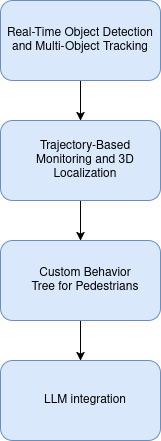

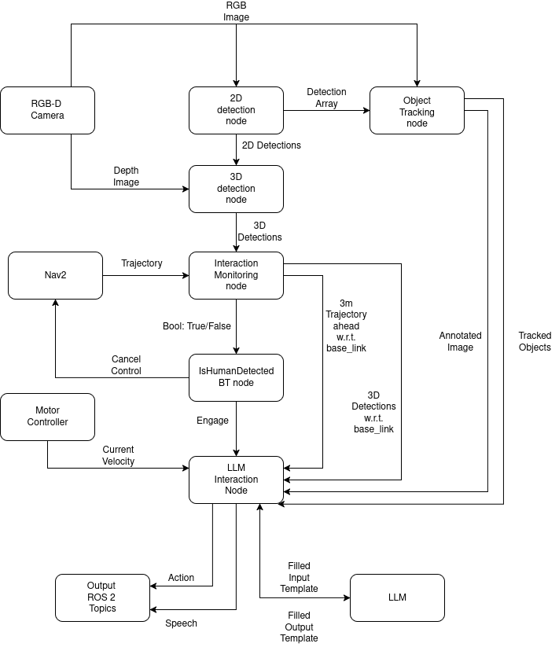

> *Figure 5.1 (thesis): complete ROS 2 node graph showing all topics between the RGB-D camera, 2D/3D detection nodes, object tracking node, interaction monitoring node, BT executor, LLM interaction node, and motor controller.*

Key data paths:

| Topic | Type | From → To |
|---|---|---|
| `/yolo_result` | `YoloResult` | YOLOv8n node → DeepSORT |
| `/tracked_objects` | custom `TrackedObjects` | DeepSORT → `trajectory_watcher` + LLM node |
| `/detection_3d_array` | `vision_msgs/Detection3DArray` | 3D detection node → `trajectory_watcher` |
| `/plan` | `nav_msgs/Path` | Nav2 → `trajectory_watcher` + LLM node |
| `/is_human_detected` | `std_msgs/Bool` | `trajectory_watcher` → BT `IsHumanDetected` |
| `/trajectory_ahead` | `nav_msgs/Path` | `trajectory_watcher` → LLM node |
| `/run_llm` | `std_srvs/Trigger` (service) | BT `CallLLMService` → LLM node |
| `/llm_action` `/llm_speech` | `std_msgs/String` | LLM node → output stack |

---

## Stage 1 — Real-Time Pedestrian Detection & Tracking

### Detection: YOLOv8n

The `ultralytics_ros` package runs **YOLOv8n** (3.2 M parameters) at **11–12 Hz** on the Jetson Orin NX — satisfying the ≥10 Hz constraint imposed by the robot's 0.5 m/s top speed (fresh percept every 0.05 m). YOLOv8m was evaluated but rejected (2–3 Hz on the platform).

**Detector benchmark results (MOT17 vs custom MOBY dataset):**

| Metric | MOT17 (YOLOv8n) | MOBY indoor (YOLOv8n) |
|---|---|---|
| mAP@0.5 | 0.252 | **0.736** |
| mAP@0.5:0.95 | 0.223 | 0.488 |
| mAP (large) | 0.369 | 0.681 |
| mAR@100 | 0.266 | 0.556 |

The large gap between MOT17 and MOBY results is expected: the indoor hospital-like setting offers consistent lighting, fixed camera height (197 mm), and fewer occlusions.

<table>
<tr>
<td>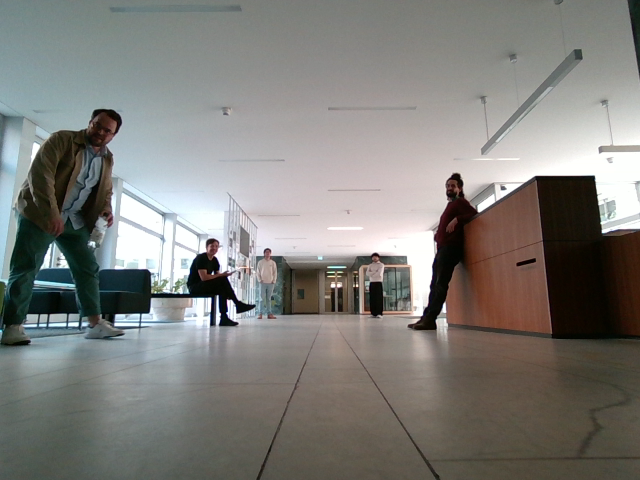</td>
<td>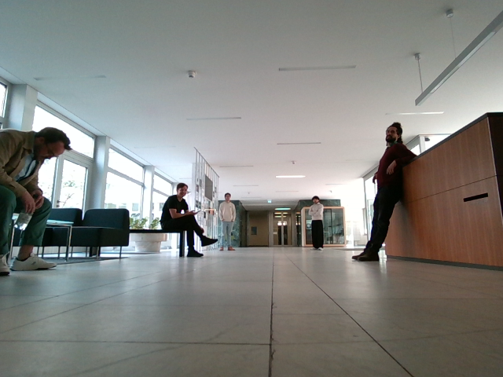</td>
<td>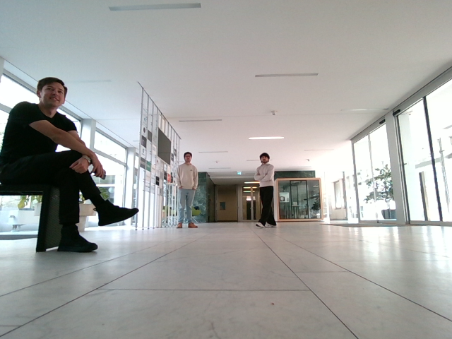</td>
<td>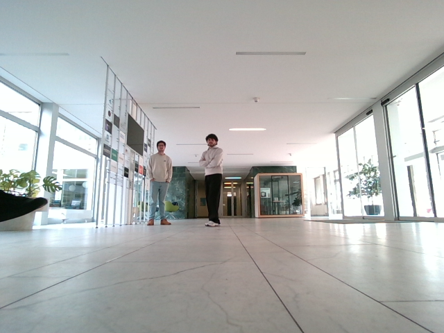</td>
</tr>
<tr>
<td>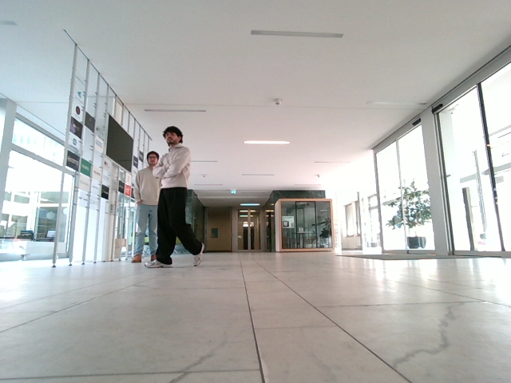</td>
<td>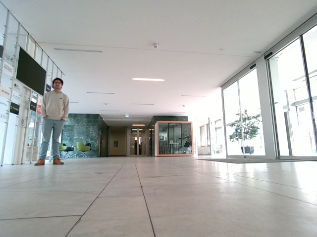</td>
<td>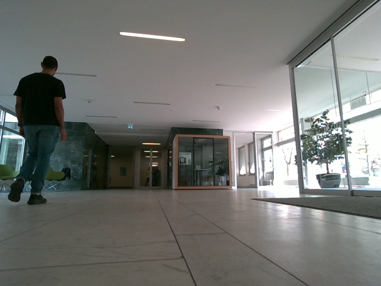</td>
<td>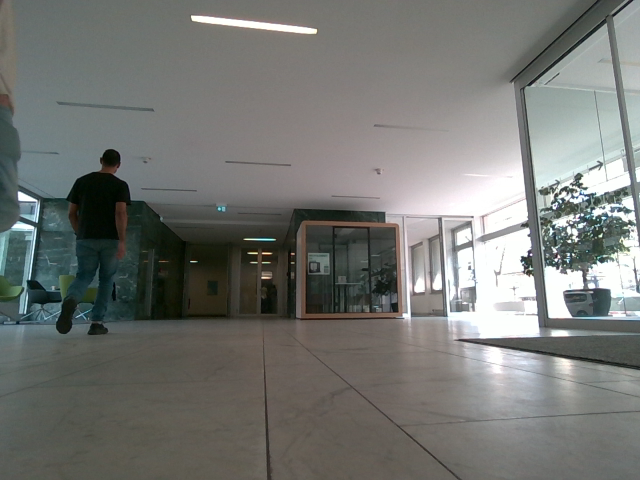</td>
</tr>
</table>

> *Figures 4.3–4.4 (thesis): representative frames from the 312-frame custom MOBY dataset recorded onboard the robot in an indoor office lobby.*

### Tracking: DeepSORT

A custom ROS 2 wrapper around **DeepSORT** (Deep Simple Online and Realtime Tracking) assigns persistent track IDs across frames, computes per-object velocity vectors (vx, vy in pixels/s), and publishes annotated images for debugging.

**Tracker benchmark results (MOT17 with ground-truth detections):**

| Metric | DeepSORT | FairMOT | SORT |
|---|---|---|---|
| HOTA | **72.57%** | 67.5% | — |
| AssA | 71.76% | — | 48.1% |
| AssRe | 82.38% | 73.7% | — |
| AssPr | 84.36% | — | — |

Key DeepSORT parameters (`params.yaml`): `max_dist=0.4`, `max_age=30 frames`, `n_init=5`, `nn_budget=200`, operating at 10 FPS (`time_interval=0.1 s`).

---

## Stage 2 — Trajectory Monitoring (`trajectory_watcher`)

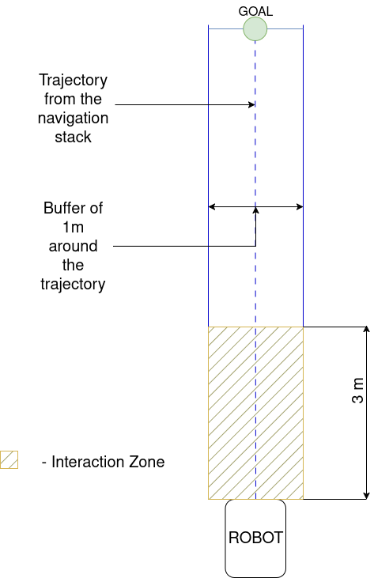

> *Figure 5.3 (thesis): the 1 m buffered trajectory corridor with the 3 m interaction zone highlighted in yellow.*

The `trajectory_watcher` node fuses three inputs — the global Nav2 plan, 3D detections, and current velocity — to decide whether any pedestrian intersects the robot's intended path.

**Algorithm:**
1. Receives `/plan` (`nav_msgs/Path`), transforms all poses into `base_link` frame via TF2.
2. Builds a **1 m laterally buffered polygon** (robot width 820 mm + 90 mm safety margin each side) around the trajectory.
3. Defines the **Interaction Zone** as the first **3 m** of this corridor ahead of the robot (~6 s lead time at max speed).
4. For each 3D detection on `/detection_3d_array`, transforms its centroid to `base_link` and performs a point-in-polygon check.
5. Publishes `/is_human_detected` (`std_msgs/Bool`) — the trigger consumed by the BT.
6. Also publishes `/trajectory_ahead` (first 3 m of path in `base_link` frame) for the LLM prompt.

---

## Stage 3 — Custom Navigate-to-Pose Behavior Tree

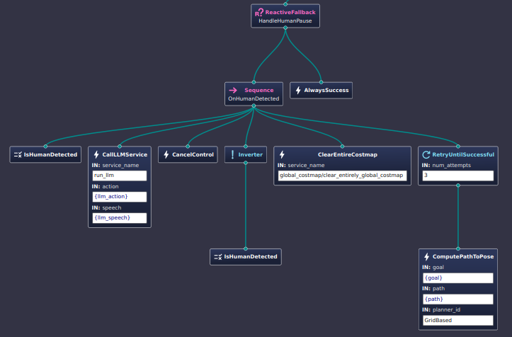

> *Figure 5.5 (thesis): Groot2 visualisation of the `HandleHumanPause` ReactiveFallback subtree.*

The BT extends the standard Nav2 `Navigate-to-Pose` tree with a **pedestrian-pause mechanism** while preserving all default planning and control behaviour when no pedestrians are present.

```xml
<root main_tree_to_execute="MainTree">
  <BehaviorTree ID="MainTree">
    <PipelineSequence name="MainLoop">

      <!-- Phase 1: controller / planner selection -->
      <ControllerSelector selected_controller="{selected_controller}" .../>
      <PlannerSelector    selected_planner="{selected_planner}"    .../>

      <!-- Phase 2: compute initial global plan -->
      <ComputePathToPose goal="{goal}" path="{path}" planner_id="GridBased"/>

      <!-- Phase 3: pedestrian pause & replan -->
      <ReactiveFallback name="HandleHumanPause">
        <Sequence name="OnHumanDetected">
          <IsHumanDetected/>                          <!-- custom BT plugin -->
          <CallLLMService service_name="run_llm" .../><!-- triggers scene_understanding_service -->
          <CancelControl/>                            <!-- immediate stop -->
          <Inverter><IsHumanDetected/></Inverter>     <!-- wait until path is clear -->
          <ClearEntireCostmap .../>
          <RetryUntilSuccessful num_attempts="3">
            <ComputePathToPose goal="{goal}" path="{path}" planner_id="GridBased"/>
          </RetryUntilSuccessful>
        </Sequence>
        <AlwaysSuccess/>                              <!-- no human → pass through -->
      </ReactiveFallback>

      <!-- Phase 4: robust path execution -->
      <RetryUntilSuccessful num_attempts="99">
        <Sequence name="FollowUntilDone">
          <FollowPath path="{path}" controller_id="{selected_controller}"/>
          <GoalReached goal="{goal}" robot_base_frame="base_link"/>
        </Sequence>
      </RetryUntilSuccessful>

    </PipelineSequence>
  </BehaviorTree>
</root>
```

**Custom BT plugin — `IsHumanDetected`** (`bt_plugins/src/is_human_detected.cpp`):  
A `BT::ConditionNode` that subscribes to `/is_human_detected` using a dedicated callback group, ensuring the subscription stays live inside Nav2's multi-threaded executor. Returns `SUCCESS` ⟺ latest message is `true`.

**Design rationale:**
- `RetryUntilSuccessful(99)` around `FollowPath` prevents Nav2 from prematurely aborting the high-level goal during the pause (when `CancelControl` deliberately makes `FollowPath` fail).
- LLM is invoked **only on demand** via `/run_llm` service — not as a continuous subscriber — capping token cost to moments requiring a decision.
- Default Nav2 recovery manoeuvres (`Spin`, `BackUp`) were removed as they are outside MOBY's validated operating modes.

---

## Stage 4 — LLM Integration (`scene_understanding_service.py`)

### Model Selection

Three multimodal LLMs were benchmarked across 10 indoor scenes (image + YOLO detections):

| Model | Latency | Cost | Action Acc. | Speech Acc. |
|---|---|---|---|---|
| **Groq Llama-4 Scout 17B** | **0.553 s** | **$0.00118** | **1.00** | **1.00** |
| GPT-4o-mini | 2.102 s | $0.02181 | 0.80 | 0.80 |
| Claude-3 Haiku | 6.233 s | $0.00621 | 0.90 | 0.30 |

**Groq Scout 17B** was selected: sub-second latency (~553 ms average, <100 ms end-to-end for 1k-token multimodal requests), perfect task accuracy, lowest cost, and an OpenAI-compatible API endpoint allowing drop-in substitution within the ROS-LLM framework.

### Prompt Architecture

Every `/run_llm` request assembles a two-block prompt:

**System prompt** (static, ~120 tokens — sent with every call):
```
You are the high-level navigation & interaction brain.
Robot base: diff-drive | max_lin_vel: 0.5 m/s | max_ang_vel: 0.1 rad/s
footprint: width 0.80 m, length 1.45 m, height 1.80 m
Indoor office lobby. Moving Humans have right of way.
Static obstacles: chairs, plants, static humans
Dynamic obstacles: humans.
Return ONLY JSON:
{ "action": "<stop|yield|proceed>",
  "speech": "<polite one-line message to the human>",
  "reason": "<brief justification>" }
```

**User message** (dynamic — rebuilt per call):

| Placeholder | Content |
|---|---|
| `{detections_json}` | 2D bbox coordinates + confidence scores per detected person (in `base_link` frame) |
| `{traj_json}` | Next 5 m of planned trajectory waypoints |
| `{vel_json}` | Current linear + angular velocity |
| `{tracker_json}` | Tracked person IDs + 3D velocity twists |
| image block | Annotated RGB frame (base64 PNG) with bounding boxes and velocity arrows |

---

## Evaluation Results

Experiments were conducted in the Sphaira Medical GmbH office building across **3 routes** and **7 scenarios**.

### Route A — Open Wide Vestibule

<table>
<tr>
<td>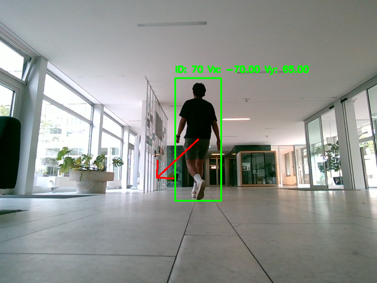</td>
<td>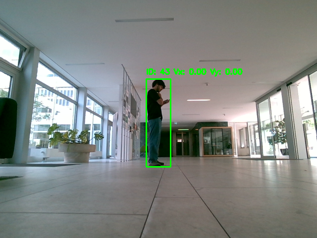</td>
</tr>
<tr>
<td>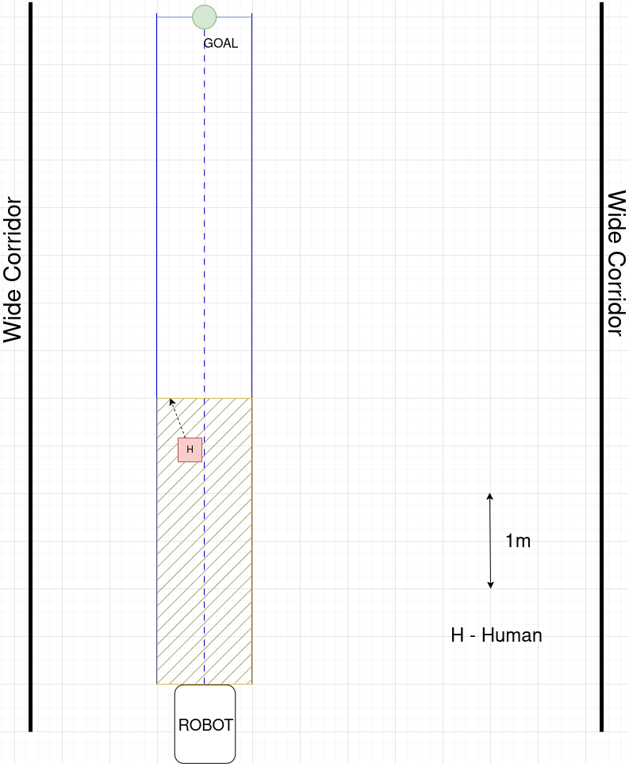</td>
<td>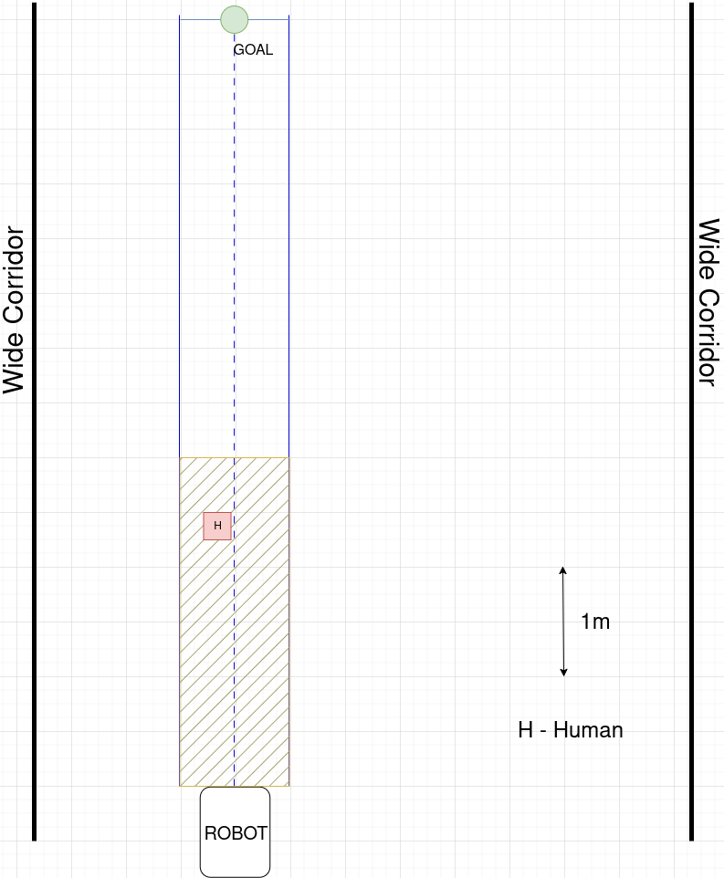</td>
</tr>
</table>

> *Figures 6.1–6.2 (thesis): Route A scenarios — camera views (top) and top-down route diagrams (bottom).*

| Scenario | Situation | LLM Action | Speech | Latency |
|---|---|---|---|---|
| A-1 | Pedestrian crossing diagonally at 2.48 m | `yield` | *"Excuse me, I'm passing by."* | 912 ms |
| A-2 | Pedestrian standing still, slightly off-centre | `proceed` | *"Hello, please give me some space."* | 1164 ms |

### Route B — Narrow Hallway (165 cm wide)

<table>
<tr>
<td></td>
<td>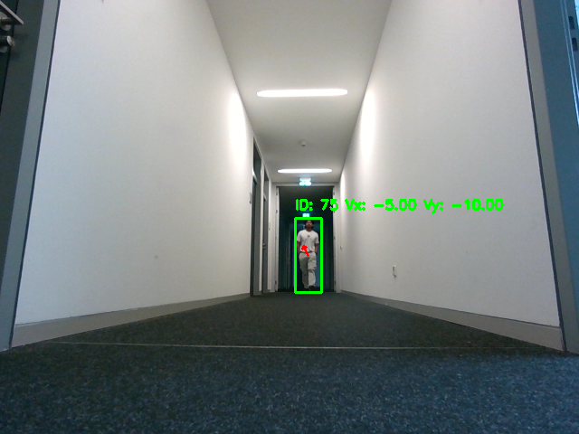</td>
</tr>
<tr>
<td>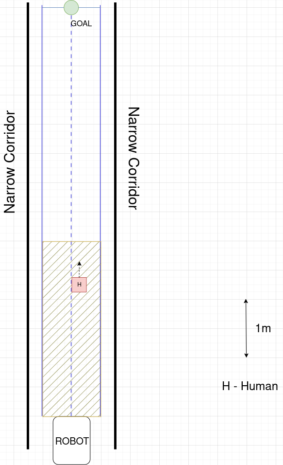</td>
<td>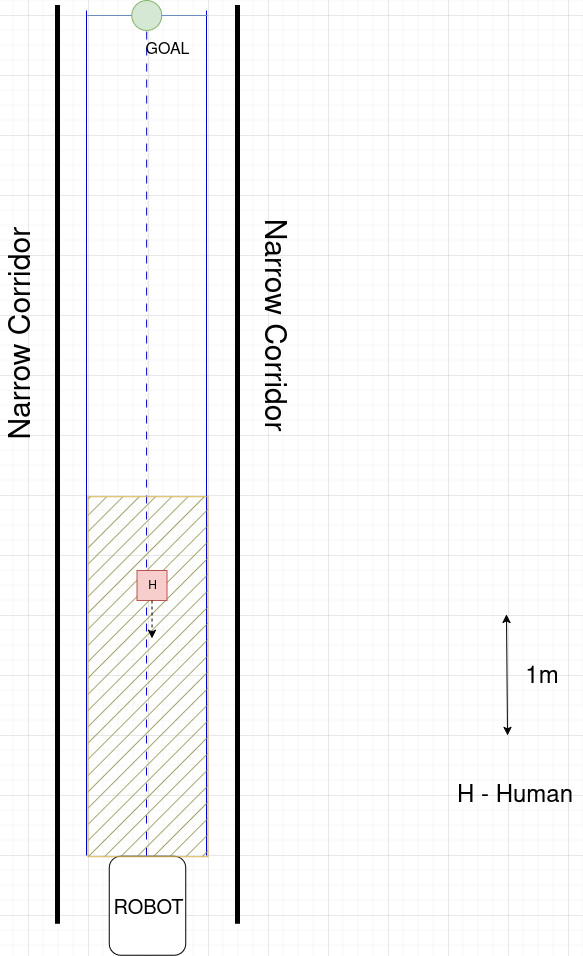</td>
</tr>
</table>

> *Figures 6.3–6.4 (thesis): Route B — pedestrian moving away (left) and approaching head-on (right).*

| Scenario | Situation | LLM Action | Speech | Latency |
|---|---|---|---|---|
| B-1 | Pedestrian walking away in same direction | `proceed` | *"passing by"* | 1565 ms |
| B-2 | Pedestrian walking directly towards robot | `yield` | *"Watch out, I'm approaching."* | 1119 ms |

### Route C — T-Junction

<table>
<tr>
<td>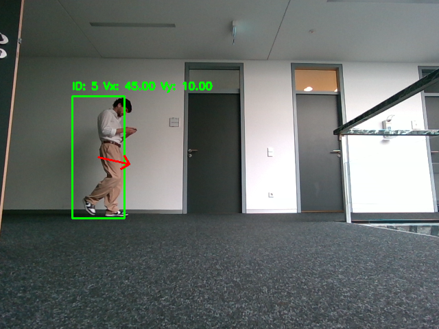</td>
<td>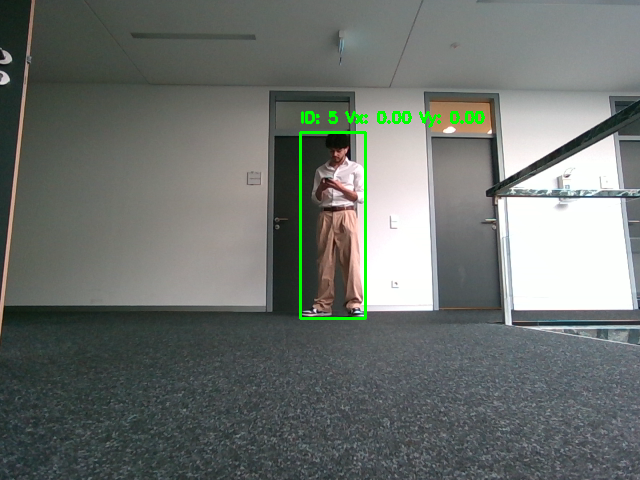</td>
<td>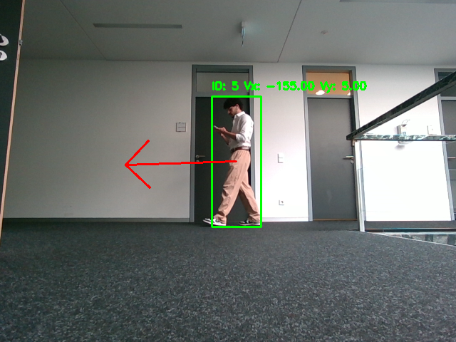</td>
</tr>
<tr>
<td>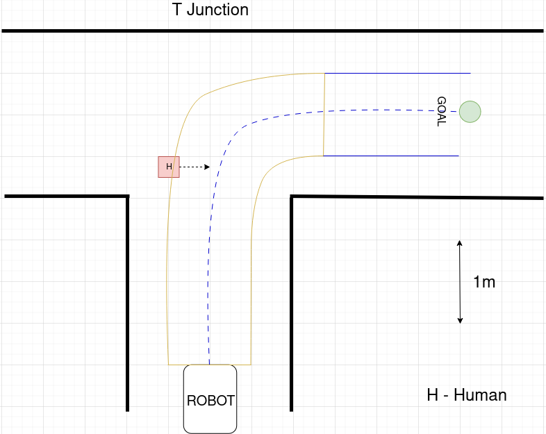</td>
<td>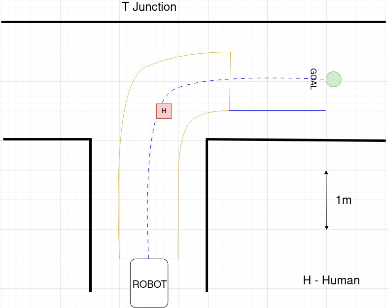</td>
<td>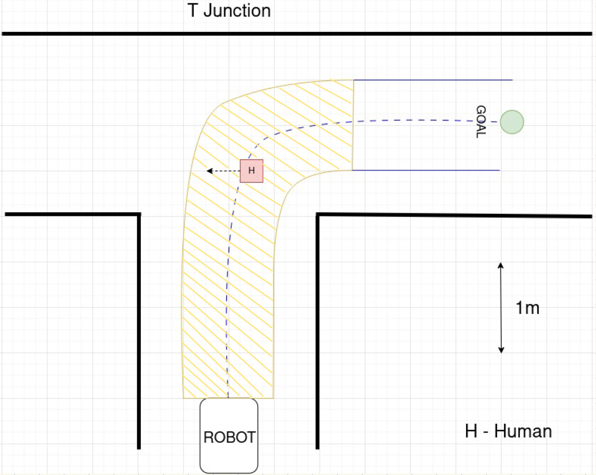</td>
</tr>
</table>

> *Figures 6.5–6.7 (thesis): Route C — pedestrian crossing from the left, stationary at junction, and moving away right-to-left.*

| Scenario | Situation | LLM Action | Speech | Latency |
|---|---|---|---|---|
| C-1 | Pedestrian entering from left, crossing turn path | `yield` | *"Excuse me, I'm going to pass by."* | 784 ms |
| C-2 | Pedestrian stationary at junction centre | `proceed` | *"Excuse me, I'm navigating through."* | 816 ms |
| C-3 | Pedestrian moving away right-to-left | `proceed` | *"Excuse me, I'm navigating through."* | 845 ms |

The system consistently produced socially appropriate, interpretable responses. Latencies ranged from **784 ms to 1565 ms** across scenarios. The LLM correctly leveraged pedestrian velocity vectors to distinguish crossing vs. clearing situations (e.g., C-3: person leaving shared space → `proceed` rather than `yield`).

---

## Repository Structure

```
moby-scene-navigation/
├── README.md
├── navigate_to_pose_llm.xml              # Pedestrian-aware BT definition
├── docs/
│   ├── robot/                            # MOBY platform photos
│   ├── architecture/                     # Pipeline and data flow diagrams
│   ├── behavior_tree/                    # BT Groot2 visualisation
│   ├── tracker/                          # Tracker visualisation
│   ├── evaluation/                       # Route maps and scenario screenshots
│   └── dataset/                          # Sample frames from MOBY dataset
└── src/
    ├── bt_plugins/
    │   └── src/is_human_detected.cpp     # Custom BT::ConditionNode
    ├── trajectory_watcher/               # Interaction zone monitor
    ├── ultralytics_ros/                  # YOLOv8n tracker + depth 2D→3D node
    ├── deep_sort_tracker/                # DeepSORT ROS 2 wrapper
    ├── human_3d_locator/                 # RealSense depth ROI deprojection
    ├── ros_llm/                          # LLM scene understanding service
    │   ├── llm_model/                    # scene_understanding_service.py
    │   ├── llm_config/                   # API config
    │   ├── llm_input/                    # speech-to-text (optional)
    │   └── llm_output/                   # text-to-speech (optional)
    └── mot17_publisher/                  # MOT17 GT publisher for tracker eval
```

---

## Dependencies

| Category | Package / Tool |
|---|---|
| Middleware | ROS 2 Humble |
| Navigation | Nav2, BehaviorTree.CPP v3 |
| Detection | `ultralytics_ros` (YOLOv8n), PyTorch, CUDA |
| Tracking | DeepSORT (`deep_sort_tracker`) |
| LLM | `ros_llm`, Groq API (Llama-4 Scout 17B via OpenAI-compatible endpoint) |
| Localization | Bosch Localization, `robot_localization` (EKF), `rf2o_laser_odometry` |
| Geometry | `shapely`, `tf2_ros`, `cv_bridge` |
| Evaluation | TrackEval (HOTA), TorchMetrics (mAP/mAR) |

---

## Conclusion

This thesis demonstrated a novel pipeline for *human-aware robot navigation* by integrating LLM-based scene understanding within a reactive Behavior Tree control architecture. Key contributions:

- **`trajectory_watcher`** — a novel ROS 2 node that continuously monitors the robot's planned path against 3D pedestrian detections, producing a single Boolean interaction trigger.
- **Custom Navigate-to-Pose BT** — augments the Nav2 default tree with a non-aborting pedestrian-pause mechanism, invoking the LLM only when contextually required.
- **Perception-to-prompt pipeline** — fuses YOLO detections, tracker metadata, planned trajectory, current velocity, and a live RGB frame into a structured multimodal prompt.
- **Benchmarked LLM selection** — Groq Scout 17B selected over GPT-4o-mini and Claude-3 Haiku based on latency, cost, and task accuracy across 10 indoor scenes.

The system showed promising performance in well-defined scenarios. Limitations identified include overly optimistic LLM decisions in geometrically constrained spaces where environmental clearances are not represented in the prompt. Future work: multi-zone proximity model, predictive pedestrian forecasting, and richer prompt constraints.

---

## Citation

```bibtex
@mastersthesis{thimmankatti2025,
  author  = {Ganesh Gopi Thimmankatti},
  title   = {Scene understanding \& navigation using LLMs and Behavior Trees for indoor mobile robots},
  school  = {RWTH Aachen University, Institute of Mechanism Theory, Machine Dynamics and Robotics},
  year    = {2025},
  month   = {August},
  note    = {Conducted at Sphaira Medical GmbH}
}
```
